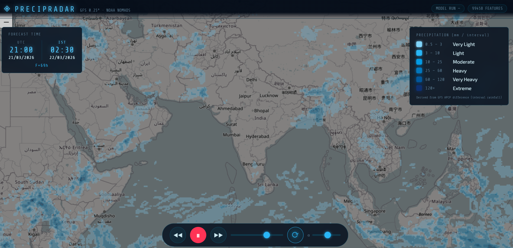

# ◈ PRECIPRADAR — Weather Precipitation Forecast Viewer

> An interactive geospatial web application that fetches, processes, and visualizes global precipitation forecasts from NOAA's Global Forecast System (GFS) in real time.



🌐 **Live Demo:** [https://adarshgis.github.io/weather_precipitation_app](https://adarshgis.github.io/weather_precipitation_app)

---

## Overview

PrecipRadar is a complete open-source pipeline for weather data acquisition, processing, and visualization. It downloads raw GRIB2 forecast data from NOAA NOMADS, converts it into lightweight GeoJSON, and renders animated precipitation layers on an interactive map — all in the browser, with no backend required at runtime.

The visualization shows precipitation intensity across the globe, animated through forecast timesteps, with synchronized UTC and IST timestamps and an intuitive playback control bar.

---

## Features

- Animated precipitation forecast across multiple timesteps (GFS 0.25° resolution)
- Dual timezone display — UTC and IST shown equally, in `HH:MM DD/MM/YYYY` format
- Six-tier intensity legend from Very Light to Extreme
- Playback controls — play, pause, step forward/back, loop toggle, timeline scrubber
- Adjustable layer opacity
- Fully responsive — works on desktop, tablet, and mobile
- Canvas-based rendering for smooth, high-performance animation
- OpenStreetMap base layer via Leaflet

---

## Tech Stack

### Data Processing (Python Pipeline)
| Tool | Purpose |
|------|---------|
| Python | Pipeline scripting |
| `cfgrib` / `xarray` | Reading and parsing GRIB2 forecast files |
| `rasterio` / GDAL | Geospatial raster processing |
| `shapely` / `geopandas` | Converting raster data to GeoJSON polygons |

### Data Formats
| Format | Role |
|--------|------|
| GRIB2 | Raw source forecast data from NOAA NOMADS |
| GeoJSON | Processed output consumed by the web viewer |

### Web Visualization
| Tool | Purpose |
|------|---------|
| Leaflet.js | Interactive map rendering |
| HTML5 Canvas | High-performance polygon animation |
| Vanilla JavaScript | Application logic and playback engine |
| CSS3 | Dark HUD UI with responsive layout |

### Deployment & Automation
| Tool | Purpose |
|------|---------|
| GitHub Pages | Static site hosting |
| GitHub Actions | Automated pipeline scheduling and GeoJSON updates |

---

## Project Structure

```
weather_precipitation_app/
│
├── geojson/
│   └── precipitation_timeseries.geojson   # Processed forecast data
│
├── index.html                              # Main web application
├── script.js                              # Map rendering & playback engine
├── style.css                              # Dark HUD UI styles
│
├── pipeline/                              # Python data processing scripts
│   ├── 01_downloading_data.py             # Downloads GRIB2 from NOAA NOMADS
│   ├── 02_convert_to_cog.py               # Converts GRIB2 → GeoJSON
│   └── ...
│
└── .github/
    └── workflows/
        └── update_forecast.yml            # GitHub Actions automation
```

---

## Running Locally

### 1. Clone the repository

```bash
git clone https://github.com/adarshgis/weather_precipitation_app.git
cd weather_precipitation_app
```

### 2. Run the Python pipeline (optional — to refresh data)

Install dependencies:
```bash
pip install cfgrib xarray rasterio geopandas shapely
```

Run the pipeline:
```bash
python pipeline/01_downloading_data.py
python pipeline/02_convert_to_cog.py
```

This will update `geojson/precipitation_timeseries.geojson` with the latest GFS forecast.

### 3. Serve the web app locally

The app must be served over HTTP (not opened as a file) due to browser CORS restrictions:

```bash
python -m http.server 8000
```

Then open [http://localhost:8000](http://localhost:8000) in your browser.

> **Tip:** If changes don't appear after redeployment, do a hard refresh:
> - Desktop: `Ctrl + Shift + R` (Windows/Linux) or `Cmd + Shift + R` (Mac)
> - Mobile: Open in incognito/private mode

---

## Deploying to GitHub Pages

1. Push your repository to GitHub
2. Go to **Settings → Pages**
3. Set source to **Deploy from a branch**, select `main` and `/ (root)`
4. GitHub Pages will serve the app at `https://<your-username>.github.io/<repo-name>/`

> Make sure the `geojson/` folder and its contents are committed — GitHub Pages will return a 404 if the GeoJSON file is missing or the path casing doesn't match exactly (Linux is case-sensitive).

---

## Data Source

Forecast data is sourced from **NOAA NOMADS** (National Operational Model Archive and Distribution System):

- **Model:** GFS (Global Forecast System) — 0.25° resolution
- **Variable:** APCP (Accumulated Precipitation), converted to interval rainfall
- **URL:** [https://nomads.ncep.noaa.gov](https://nomads.ncep.noaa.gov)

---

## Screenshot


*Global precipitation forecast animation with UTC/IST timestamp display and intensity legend.*

---

## License

This project is open source. See [LICENSE](LICENSE) for details.

---

## Author

**Adarsh** — [github.com/adarshgis](https://github.com/adarshgis)
